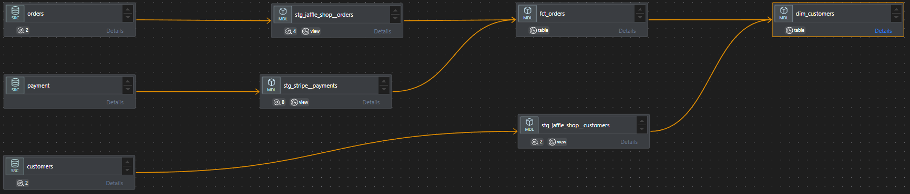

# 🏪 Jaffle Shop Analytics Warehouse

A modern analytics warehouse project for **Jaffle Shop**, a fictional e-commerce company. This project implements a robust data transformation pipeline using **dbt (Data Build Tool)** integrated with **Snowflake**, structured for scalability, clarity, and governance across environments.

📚 **Project Documentation**:  
Explore the complete documentation with model lineage, schema descriptions, and tests via the [dbt Docs site](https://adlerabf.github.io/bbaggins-dbt-quickstart).  
*Hosted locally from the `target` folder generated by `dbt docs generate`.*

---

## 🚀 Purpose

The goal of this project is to deliver a reliable and maintainable data warehouse by transforming raw application and payment data into well-modeled datasets that support downstream analytics, reporting, and data science use cases.

---

## 🧱 Project Structure

This project follows a modular approach based on **staging → marts** modeling layers and leverages dbt best practices such as:

- Modular SQL with `ref()` and `source()`
- Clear separation of concerns between raw data and business logic
- DAG-based dependency management
- Scalable and testable model architecture

---

## 🗺️ Lineage DAG Overview

Below is a visual representation of the data flow across staging and marts layers:

> _This diagram illustrates the model dependencies and helps stakeholders understand how raw data is transformed into meaningful insights._

---

## 📊 Key Models

### `stg_jaffle_shop_customers`, `stg_jaffle_shop_orders`, `stg_stripe_payments`
- Perform **light data cleaning and renaming**
- Align source system naming to consistent warehouse standards

### `fct_orders`
- Combines `orders` with `payments`
- Calculates order-level revenue using successful payment records

### `dim_customers`
- Generates customer-level metrics such as:
  - First order date
  - Most recent order
  - Number of orders
  - Customer lifetime value

---

## ✅ Testing & Quality

dbt includes automated testing of:

- Primary key constraints (`unique`, `not_null`)
- Accepted Values
- Relationships between models

---

## 📌 Technologies Used

* dbt-core 1.10+
* Snowflake
* Visual Studio Code
* YAML Configuration
* SQL (CTEs, ref, source)

